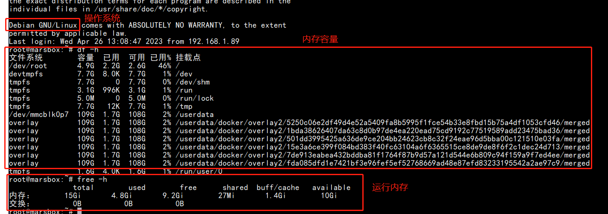
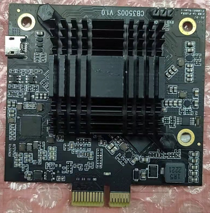
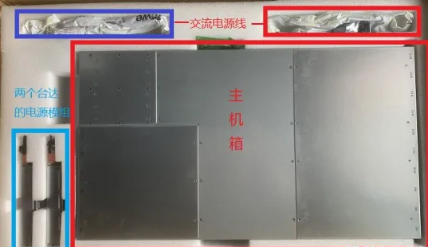
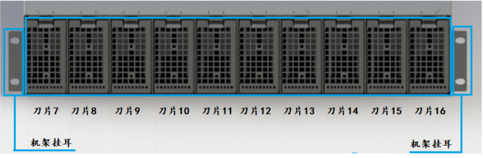
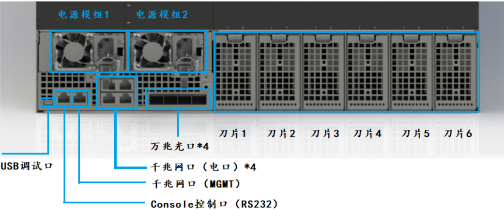
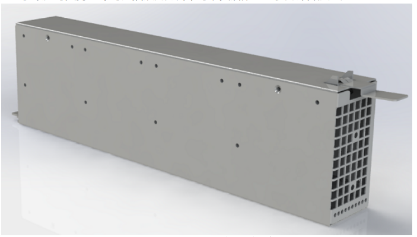
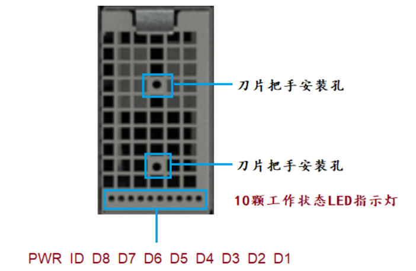

# 1. 服务器简介

## 1.1 整机服务器介绍

1. 2U机架式集群服务器规格的基于 ARM 架构的云服务器，采用刀片式结构设计。每个刀片均可热插拔，可灵活配置整机的计算能力，最大可支持16个刀片。

2. 每个刀片支持8个六核心64位 ARM 处理器,最多可支持128个六核心64位 ARM 处理器。内部架构为2核心 Cotex-A72+4核心 Cotex-A53，最高频率可达1.8GHz。

3. 整机系统采用2个（1+1冗余设计）1300W 的电源模组供电，冗余设计实现系统高可靠性。

① 整机服务器技术规格

|        参数        |                           规格参数                           |
| :----------------: | :----------------------------------------------------------: |
|      产品类型      |             2U机架式集群服务器(每个刀片可热拔插)             |
|      产品形态      |                            刀片式                            |
|        架构        |                           ARM架构                            |
|      刀片数量      |                      最大可支持16个刀片                      |
| ARM处理器(sub)数量 | 每个刀片最多可支持8个6核心ARM处理器(sub) 整机最多可支持128个核心ARM处理器(sub) 每个ARM处理器(sub)最多可支持6个云手机 |
|     处理器规格     | 6核64BIT（双核A72+四核A53） 最高频率1.8GHz 集成MALI-T860 MP4图形处理器GPU 支持4K/1080P H.265/H.264视频硬件编解码 |
|  （每个sub）内存   |                 16GB LPDDR4,总线带宽3733MBPS                 |
|  （每个sub）存储   |                     128GB EMMC（EMMC5.1)                     |
|        网络        |           万兆网口(光口)x4 千兆网口（电口）x4           |
|  电源模组（PSU）   | 输入电压：AC 100-240V 输出功率：1300W/PSU 工作效率：最高95%（50%负载） 1+1冗余设计 可热拔插台达（DELTA） |
|        功耗        |                        根据具体应用定                        |
|        散热        |    6个高功率风扇 最高转速16500RPM 台达（DELTA）    |
|        管理        | 专用BMC 可通过专用千兆网口通信(MGMT) 可通过RS232 115200波特率通信（CONSOLE口） |
|      操作系统      |                            Debian                            |
|      工作温度      |                            0~40°C                            |
|      工作高度      |                      海拔高度低于3000m                       |
|        湿度        |                            0~93%                             |

② ARM 处理器运行系统、内存、存储

③ ARM 处理器实物图

④ 整机包装图如下

___

## 1.2 整机前、后面板介绍

* 接线及组装, 整机接线和组装非常简单方便：

  >（1）将16个刀片盒插入主机箱上标识为N1-N16的16个刀片仓（前10后6）；
  >
  >（2）将2个电源模组分别插入两个电源仓；
  >
  >（3）接上两条240V交流电源线；
  >
  >（4）接上业务网线（根据需要可任意接4个GbE RJ45电口或者4个10GbE的SFP+光口之一），网线另外一端接交换机,如果是满载的情况下网线需要全部接上；
  >
  >（5）接上管理网线MGMT，网线另外一端接交换机；
  >
  >（6）将RS232调试线接入CONSOLE口，调试线另外一端接电脑USB口。

* 前面板说明：

  > 前面板如下图，主要是10个刀片仓位。

* 后面板说明：

  >  后面板如下图，包含6个刀片仓位、2个电源仓位（电源模组1/2包含风扇）、4个万兆网口（光口）、4个千兆网口（电口）、MGMT 千兆网口和 RS232接口(Console控制口,波特率设置为115200)、USB调试口（BMC程序下载口）。

* 刀片(Node)说明：

  > 整机最大可支持16个可热插拔的刀片，可以灵活配置整机的计算能力,每个刀片支持8个六核心64位 ARM 处理器，每个ARM处理器最多可支持6个云手机。

① 刀片图如下

② 刀片侧面图如下

③ 刀片面板指示灯说明

> D1-D8:ARM 处理器工作状态指示灯。**亮：工作正常；灭：工作异常**(D1代表第一个ARM 处理器板依次类推)
>
> ID:刀片底板工作状态指示灯。**亮：工作正常；灭：工作异常**（ARM处理器接口在底板接口上）
>
> PWR:刀片总电源状态指示灯。**亮：上电正常；灭：上电异常**

## 1.3 BMC 接口使用说明

BMC 接口使用 [MARS ARM服务器操作说明](./MARS ARM服务器操作说明V1.0.1.pdf)

