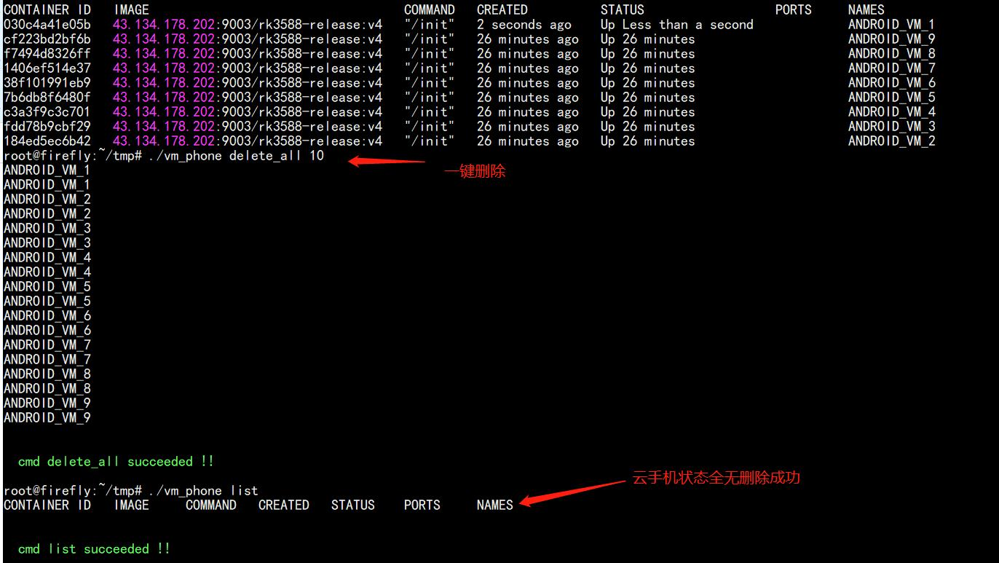

#  云手机操作文档

## 1、云手机管理控制

​    使用远程工具(eg:MobaXterm 工具)连接云手机管理；登录BMC管理，由于型号有两种1U和2U。两种模式不同,进入到BMC可以通过不同方式进入soc。

* 1U 型号

  设备分配的ip:3000 即可登录BMC管理

  账号密码：admin

  

  进入soc终端或者也可以通过ssh方式进入

  

  通过ssh方式进入:

  ssh方式连接子板ip为192.168.1.72：
  ssh账号：ssh root@192.168.1.72
  密码:marssoc

  

* 2U 型号

  1）ssh方式连接BMC主板设置ip为192.168.1.89：
  ssh root@192.168.1.89
  密码：marsserver

  2）进入soc终端

  ssh方式连接子板ip为192.168.1.72：
  ssh账号：ssh root@192.168.1.72
  密码:marssoc

## 2、 云手机操作

vm_phone 在云手机/usr/bin/vm_phone目录下,vm_phone 是针对云手机操作的统一脚本，任何操作都是基于它实现的。

vm_phone 脚本介绍：

本脚本提供 9 种对云手机操作，创建(create)、启动(start)、停止(stop)、重启(restart)、删除(delete)、查看镜像(check_image)、查看云手机状态操作(list)、一键创建(create_all)、一键删除(delete_all)，需要严格按照格式进行操作，使用说明如下：

#### 2-1 查看云手机镜像

> ./vm_phone check_image

#### 2-2、查看云手机状态 

> ./vm_phone list

会返回云手机对应的ip地址

#### 2-3、启动云手机

>  ./vm_phone start 1

当云手机状态异常是可以通过启动或者重启的方式，将云手机的状态恢复

#### 2-4、重启云手机

>  ./vm_phone restart 1

#### 2-5、停止云手机

>  ./vm_phone stop 1

#### 2-6、创建云手机

>  ./vm_phone create 1 192.168.1.100 1
>
>  参数说明：
>
>  * create 创建云手机
>
>  * 192.168.1.100 创建云手机指定ip
>
>  * 1 云手机型号
>
>    默认: s22 1:a80 2:huaweip30light 3:oneplus10pro 4:oneplus5 
>         5:pixel2xl  6:pixelxl 7:s10 8:s20plus 9:xiaomi11tpro

创建失败的原因：

1. 参数不对，参数个数，参数对应信息不对
2. 云手机网络 IP 网段和初始设置的不一样

3. 云手机名字已经存在了，需要重新创建一个新的云手机名字

#### 2-7、删除云手机

> ./vm_phone delete 1

当需要删除云手机时，可执行此操作，如果删除对应云手机数据，不可恢复，谨慎执行

删除失败原因：
1. 参数不对

2. 云手机已不存在

   

#### 2-8、一键创建云手机

> ./vm_phone create_all 10 192.168.1.100

创建失败的原因：
1. 参数不对，参数个数，参数对应信息不对
2. 云手机网络 IP 网段和初始设置的不一样
3. IP 网络超过 255，eg: 192.168.1.268
4. 云手机个别已经存在，无法继续创建
5. 后面云手机名称参数必须是 10，否则无法正常一键创建

#### 2-9、一键删除云手机

>  ./vm_phone delete_all 10
>

后面云手机名称参数必须是 10，否则无法正常一键删除

#### 2-10、云手机ip查看

> ./vm_phone list

### 3、 更新 vm_phone工具

将vm_phone脚本拷贝到/usr/bin/目录下: 

> cp vm_phone /usr/bin/vm_phone

给vm_phone赋值权限

> chmod 777 /usr/bin/vm_phone